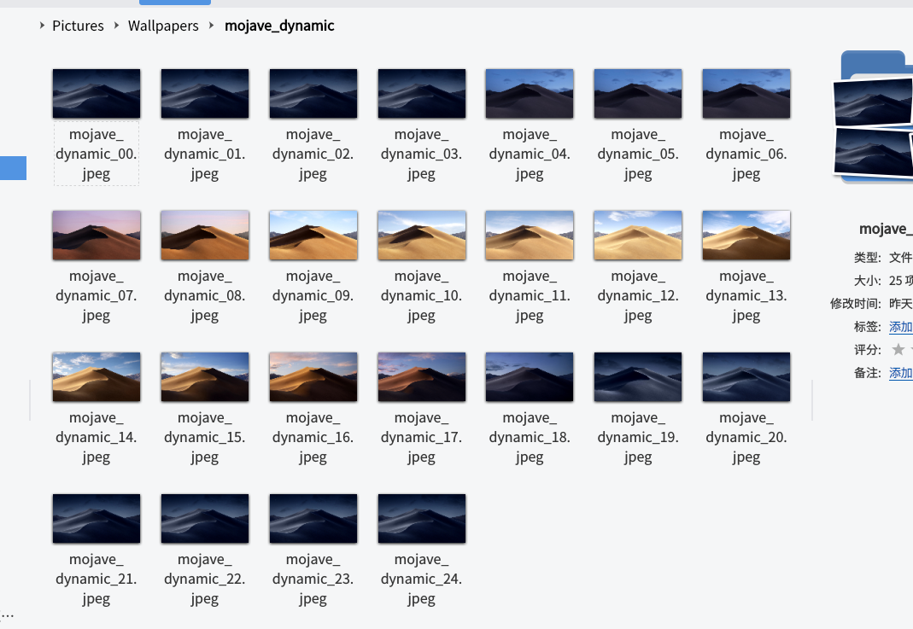

+++
category = 'Linux'
title = '[Linux/KDE] 一步步教你给 KDE 用上 macOS 专属动态壁纸'
date = '2018-12-07T00:00:00+08:00'
tags = ['KDE', 'Linux', 'Plasma', 'macOS', 'mojave']
image = 'mojave.png'
draft = false
toc = false
backtotop = true
+++

(下文中所有的 `你的用户名` 请自行替换)

首先，我们先说明所谓的 macOS 动态壁纸并不是指动态的壁纸，而是随时间变化的壁纸，macOS 原生使用了 HEIC 文件格式，其实就是内嵌了十几张同一位置拍摄的不同时间的图片，如下：



## 0. 获取并整理壁纸图片

你可以自己从 macOS 电脑提取 HEIC 文件再从里面提取上面所有的图片，当然感谢万能的 Reddit，你也可以在这里找到所有的资源 [Reddit Page](https://www.reddit.com/r/apple/comments/8oz25c/all_16_full_resolution_macos_mojave_dynamic/)，然后按上面的格式排列一下所有的图片，文件名里面的数字表示当前的小时数，你可以根据自己的喜好调整黑夜的时长哦，反正晚上就用最黑的那张就好了。

## 1. 编写脚本

接下来，我们需要~~抄~~写两个脚本用来使壁纸变化起来。

首先，第一个脚本是用来修改所有桌面的壁纸的脚本，是其他网友分享的脚本，可以保存为 `/home/你的用户名/bin/ksetwallpaper` ，后文以此路径为例，请注意对应修改为你的路径。

```python
#!/usr/bin/env python3
import dbus
import argparse

jscript = """
var allDesktops = desktops();
print (allDesktops);
for (i=0;i<allDesktops.length;i++) {
    d = allDesktops[i];
    d.wallpaperPlugin = "org.kde.image";
    d.currentConfigGroup = Array("Wallpaper", "org.kde.image", "General");
    d.writeConfig("Image", "file://%s")
}
"""

parser = argparse.ArgumentParser(description='KDE Wallpaper setter')
parser.add_argument('file', help='Wallpaper file name')
args = parser.parse_args()


bus = dbus.SessionBus()
plasma = dbus.Interface(bus.get_object('org.kde.plasmashell', '/PlasmaShell'),
dbus_interface='org.kde.PlasmaShell')

plasma.evaluateScript(jscript % args.file)
```

写入这个脚本以后，执行 `chmod +x /home/你的用户名/bin/ksetwallpaper` 添加可执行权限。

然后是第二个脚本，目的是获取当前的小时数并且设置壁纸和锁屏壁纸。

保存为 `/home/你的用户名/bin/wallpaper_timechange`

(假设你的壁纸保存路径为 `/home/你的用户名/Pictures/Wallpapers/mojave_dynamic`)

```bash
#!/bin/env bash
hour=$(date "+%H")
/home/你的用户名/bin/ksetwallpaper /home/你的用户名/Pictures/Wallpapers/mojave_dynamic/mojave_dynamic_${hour}.jpeg
kwriteconfig5 --file kscreenlockerrc --group Greeter --group Wallpaper --group org.kde.image --group General --key Image "/home/你的用户名/Pictures/Wallpapers/mojave_dynamic/mojave_dynamic_${hour}.jpeg"
```

然后依然是给这个脚本添加可执行权限 `chmod +x /home/你的用户名/bin/wallpaper_timechange`

## 2. 编写用户单元和定时器

这里当然要用上超级好用的 SYSTEMD! (Selling my underpants!)

我们要新建一个用户单元用于执行换壁纸的任务，另一个用户定时器用来定时执行前面的脚本。

首先，我们新建一个文件，假如文件路径为 `/home/你的用户名/.config/systemd/user/wallpaper-hourly.service`

```
[Unit]
Description=Set wallpaper according to hour

[Service]
Type=oneshot
ExecStart=/home/你的用户名/bin/wallpaper_timechange
```

这个脚本很简单，运行它就执行一遍换壁纸脚本。

第二个就是定时脚本，我们可以很方便的使用 systemd 编写定时器任务 ~~(See U Crontab)~~，再假如文件路径为 `/home/你的用户名/.config/systemd/user/wallpaper-hourly.timer`

```
[Unit]
Description=Change wallpaper hourly

[Timer]
# OnBootSec=10sec
OnActiveSec=5sec
OnCalendar=hourly
Persistent=true
Unit=wallpaper-hourly.service

[Install]
WantedBy=timers.target
```

这个定时器指定了两个任务，一个是 `OnBootSec`，任务是开机后 10 秒执行，另一个是小时周期任务，预订为每小时 0 分 0 秒执行，安排上了！

保存这两个文件以后，记住两个脚本的名称～

然后进入终端，运行下面的命令们

```
systemctl --user daemon-reload # 重载用户单元
systemctl --user enable wallpaper-hourly.timer # 开机自启动定时器
systemctl --user start wallpaper-hourly.timer # 运行定时器
```

然后可以使用 `systemctl --user status wallpaper-hourly.timer` 检查一下是否正常启动，然后可以看到下次执行时间的显示如下

    ...
    Trigger: Fri 2018-12-07 22:00:00 CST; 29min left
    ...

表示下次执行时间为 2018-12-07 的 22 点整。

然后你的壁纸就会开始跟随你的系统时间变化哦。

当然，下一步还有更加棒的完善哦，比如 SDDM 背景的修改 (也许能行吧~~FLAG~~)，还有就是判断当前的日出日落时间调整，夏令时的调整 (Just imagine..)

**UPDATE 1:**

可以修改条件为 OnActiveSec=5sec 指定 timers 运行后 5 秒运行一次任务。

**The End**
